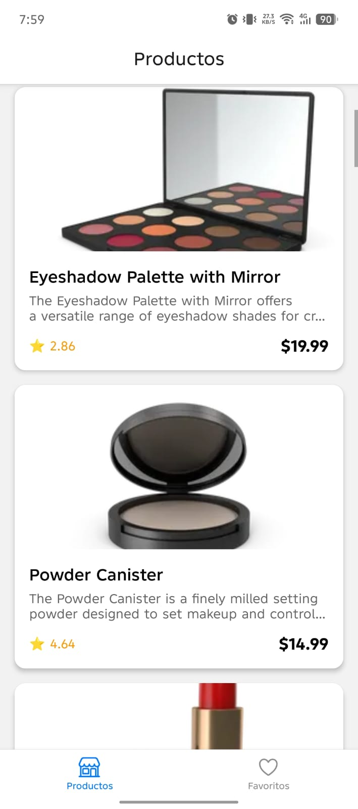
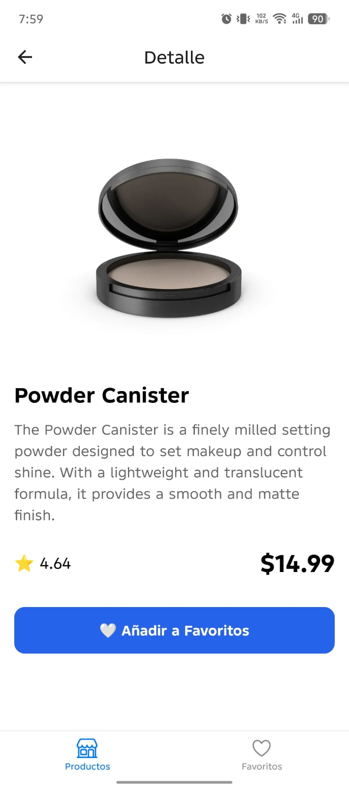
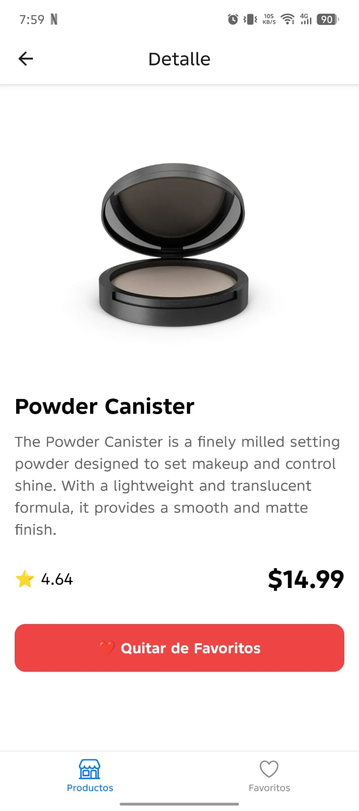
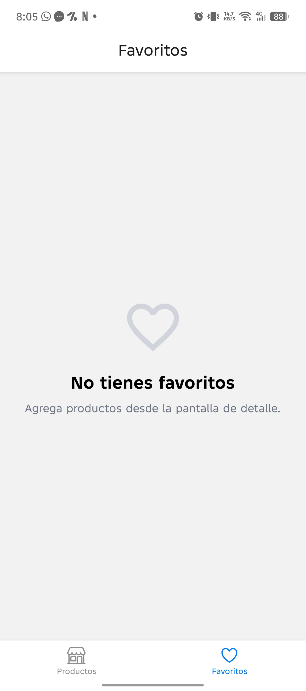
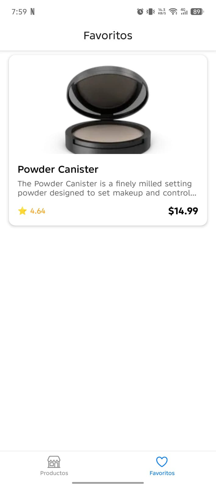

# Mini Market - Mobile

Aplicación desarrollada en React Native Expo.

Permite consultar productos, ver su detalle y guardar favoritos de forma local.

---

## Demo

[](https://youtube.com/shorts/p5ktg1cVU-A)
click para ver

--

## Tecnologías

- React Native
- Expo SDK 54
- TypeScript
- React Navigation
- Zustand
- Axios
- AsyncStorage
- Jest

---

## Requisitos

- Node.js 22+
- Yarn
- Expo Go o Android Studio / Xcode

---

## Instalación

Clonar el proyecto.

```bash
git clone https://github.com/wilberparedes/minimarketmobile.git
```

Entrar a la carpeta.

```bash
cd mini-market
```

Instalar dependencias.

```bash
yarn
```

Iniciar la aplicación.

```bash
yarn start
```

Android.

```bash
yarn android
```

iOS.

```bash
yarn ios
```

---

## Ejecutar pruebas

```bash
yarn test
```

---

## Estructura del proyecto

```
src
├── api
├── components
├── config
├── hooks
├── navigation
├── screens
├── services
├── store
├── types
```

---

## Funcionalidades

### Lista de productos

- Consulta los productos desde el backend.
- Pull to Refresh.
- Skeleton mientras carga la información.
- Manejo de errores.
- Navegación al detalle.

### Detalle del producto

- Consulta un producto por id.
- Carrusel de imágenes.
- Información completa.
- Agregar o quitar de favoritos.

### Favoritos

- Persistencia usando AsyncStorage.
- Estado global con Zustand.
- Lista de favoritos.
- Actualización automática al modificar un favorito.

---

## Arquitectura

Se intentó mantener una estructura sencilla separando responsabilidades.

```
Screen
    ↓
Hook
    ↓
Service
    ↓
API
```

Los componentes contienen únicamente lógica de presentación.

Los hooks administran el estado de cada pantalla.

Los servicios se encargan de la comunicación con el backend.

---

## Decisiones tomadas

- Zustand fue elegido para manejar el estado global por ser una solución simple para este tamaño de aplicación.
- AsyncStorage se utilizó para persistir los favoritos entre sesiones.
- React Navigation se usó para la navegación mediante Bottom Tabs y Stack.
- Axios centraliza todas las llamadas HTTP.

---

## Testing

Se agregaron pruebas unitarias para:

- Favorite Store
- Product Service

Las pruebas utilizan Jest y React Native Testing Library.

---

## Posibles mejoras

Si el proyecto continuara, algunas mejoras serían:

- Paginación de productos.
- Búsqueda y filtros.
- Internacionalización.
- Cobertura de pruebas más amplia.
- Caché de productos.

---

## Screenshots

### Products


---

### Product Detail




---

### Favorites




---

## Autor

Wilber Paredes
